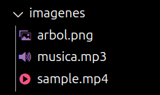

# 03 Visualización de texto, imágenes, y archivos multimedia
    
    ```python
    # En el archivo main_imagenes.py
    import streamlit as st
    
    st.image("imagenes/arbol.png", caption = "Árbol de decisión", width = 650)
    st.audio("imagenes/musica.mp3")
    st.video("imagenes/sample.mp4")
    ```
    
    
    
- Estilos
    
    ```python
    # En el archivo main_imagenes.py
    
    # Vamos a ocultar el botón de Deploy
    # Podemos hacerlo con cualquier otra clase
    st.markdown("""
    <style>
    .stAppDeployButton
    {visibility: hidden;}
    </style>
    """, unsafe_allow_html = True)
    
    # Vamos a cambiar el color del título
    # Le da un id aleatorio, pero siempre el mismo
    st.markdown("""
    <style>
      h1[id="99ac702e"] {
        background-color: #FFFFFF !important;
        color: #FF0000 !important;
      }
    </style>
    """, unsafe_allow_html=True)
    ```