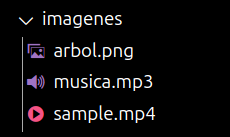

# 03 Visualización de texto, imágenes, y archivos multimedia

```python
# streamlit run main_imagenes.py
import streamlit as st
st.image("imagenes/arbol.png", caption = "Árbol de decisión", width = 650)
st.audio("imagenes/musica.mp3")
st.video("imagenes/sample.mp4")
```



Streamlit permite modificar los estilos visuales de la aplicación inyectando CSS personalizado a través de `<style>` tags dentro de `st.markdown()` con el parámetro `unsafe_allow_html=True`. Esto funciona porque Streamlit renderiza el contenido HTML directamente en la página, permitiendo sobrescribir las clases CSS internas de los componentes (como `.stAppDeployButton`). Es una forma no oficial pero muy usada para ocultar elementos, cambiar colores, fuentes, fondos, etc. Para identificar qué clase o ID usar, se inspecciona el elemento con las herramientas de desarrollo del navegador.

```python
# streamlit run main_imagenes.py

# Vamos a ocultar el botón de Deploy
# Podemos hacerlo con cualquier otra clase
st.markdown("""
  <style>
  .stAppDeployButton
  {visibility: hidden;}
  </style>
  """, unsafe_allow_html = True)

# Vamos a cambiar el color del título
# Le da un id aleatorio, pero siempre el mismo
st.markdown("""
  <style>
    h1[id="99ac702e"] {
      background-color: #FFFFFF !important;
      color: #FF0000 !important;
    }
  </style>
  """, unsafe_allow_html=True)
```
**Otras maneras de modificar estilos en Streamlit:**

1. **Tema oficial via `config.toml`**: Crear/editar `.streamlit/config.toml` con una sección `[theme]` para definir colores, fuentes, y bordes de forma oficial y mantenible.

   ```toml
   [theme]
   primaryColor = "#FF4B4B"
   backgroundColor = "#FFFFFF"
   textColor = "#262730"
   font = "sans serif"
   ```

2. **`st.html()`**: Método más limpio que `st.markdown()` para inyectar HTML y CSS (disponible desde Streamlit 1.28+).

   ```python
   st.html("""<style>.stApp { background: #f0f0f0; }</style>""")
   ```

3. **CSS dirigido con `key=`**: Los widgets con `key=` generan clases `.st-key-<nombre>`, permitiendo estilizar componentes concretos.

   ```python
   st.button("Enviar", key="mi_boton")
   # Se puede apuntar con CSS a .st-key-mi_boton button { ... }
   ```

4. **Cargar CSS desde archivo externo**: Leer un `.css` e inyectarlo.

   ```python
   with open("style.css") as f:
       st.markdown(f"<style>{f.read()}</style>", unsafe_allow_html=True)
   ```