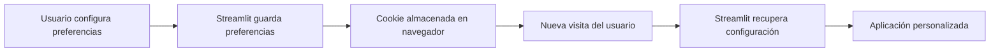
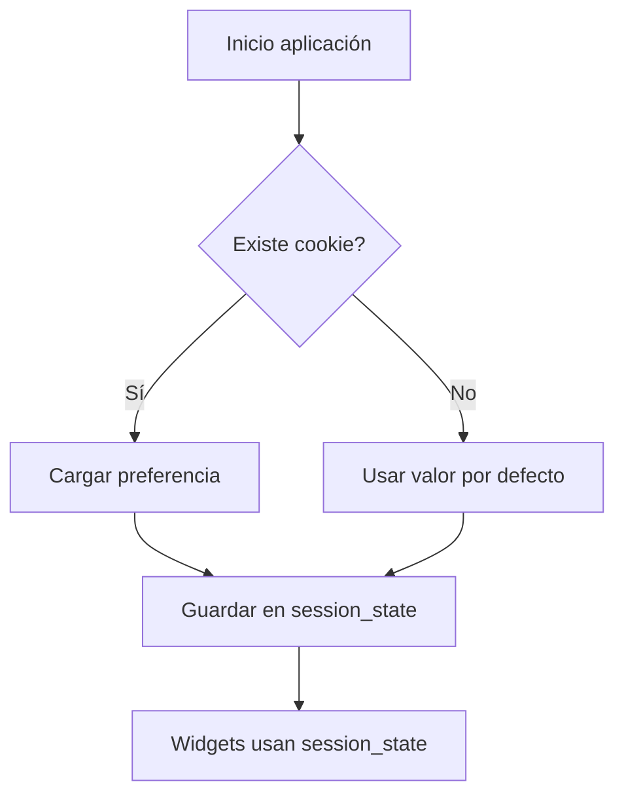

# 10. Interactividad avanzada con el estado: persistencia de preferencias mediante cookies

Hasta ahora hemos visto que `st.session_state` permite conservar información durante la interacción de un usuario con una aplicación Streamlit. Este estado vive únicamente durante la sesión activa: cuando el usuario cierra la pestaña o termina la sesión, la información almacenada desaparece.

En muchas aplicaciones es necesario conservar algunas preferencias del usuario entre sesiones, por ejemplo:

* Tema visual elegido (claro u oscuro).
* Idioma seleccionado.
* Filtros utilizados habitualmente.
* Configuración de visualización.
* Última sección visitada.
* Preferencias de formato o unidades.

Para este tipo de información se utilizan normalmente las **cookies**.

## ¿Qué son las cookies?

Las cookies son pequeños fragmentos de información que una aplicación web guarda en el navegador del usuario. La próxima vez que el usuario accede a la aplicación, el navegador puede enviar esas cookies y la aplicación puede recuperar las preferencias almacenadas.

Un esquema habitual es:



Por ejemplo:

1. El usuario selecciona idioma español.
2. La aplicación guarda esa preferencia en una cookie.
3. El usuario cierra la aplicación.
4. Al volver otro día, Streamlit lee la cookie.
5. La aplicación aparece directamente en español.

## Diferencia entre `st.session_state` y cookies

Ambos mecanismos permiten recordar información del usuario, pero tienen objetivos diferentes:

| Característica | `st.session_state`               | Cookies                                   |
| -------------- | -------------------------------- | ----------------------------------------- |
| Duración       | Mientras dura la sesión          | Entre sesiones                            |
| Ubicación      | Memoria de Streamlit             | Navegador del usuario                     |
| Uso habitual   | Datos temporales de interacción  | Preferencias persistentes                 |
| Ejemplo        | Valor de un formulario           | Idioma elegido                            |
| Seguridad      | No debe contener datos sensibles | Tampoco debe contener información privada |

Una forma habitual de trabajar es combinar ambos mecanismos:



La cookie actúa como almacenamiento permanente y `st.session_state` como memoria de trabajo durante la ejecución.

---

## Uso de cookies en Streamlit

Streamlit no proporciona directamente una API de cookies como otros frameworks web tradicionales. Para trabajar con ellas normalmente se utilizan componentes externos.

Una de las opciones habituales es instalar:

```bash
pip install streamlit-cookies-manager
```

Después podemos crear un gestor de cookies:

```python
# streamlit run manejo_cookies.py
import streamlit as st
from streamlit_cookies_manager import EncryptedCookieManager


cookies = EncryptedCookieManager(
    prefix="mi_aplicacion/",
    password="una_clave_segura"
)

if not cookies.ready():
    st.stop()
```

El objeto `cookies` permite leer y escribir valores almacenados en el navegador.

Al crear el objeto `EncryptedCookieManager` se indican dos parámetros importantes:

```python
cookies = EncryptedCookieManager(
    prefix="preferencias/",
    password="clave_segura"
)
```

### Parámetro `prefix`

`prefix` define un **prefijo identificador** que se añadirá al nombre de las cookies creadas por la aplicación.

```python
prefix="preferencias/"
```

Sirve principalmente para:

* Evitar conflictos si varias aplicaciones usan cookies en el mismo navegador.
* Organizar las cookies relacionadas con una aplicación concreta.
* Diferenciar distintos grupos de información almacenada.

Por ejemplo, si guardamos:

```python
cookies["idioma"] = "es"
```

el navegador no almacenará simplemente una cookie llamada `idioma`, sino una cookie asociada al prefijo definido, algo similar a:

```
preferencias/idioma = es
```

Si una misma instalación del navegador tiene varias aplicaciones Streamlit, cada una puede utilizar un prefijo diferente:

```python
prefix="app_ventas/"
```

o:

```python
prefix="panel_analisis/"
```

---

### Parámetro `password`

El parámetro `password` se utiliza para proteger el contenido almacenado en las cookies.

```python
password="clave_segura"
```

Las cookies normales guardan texto directamente en el navegador, pero `EncryptedCookieManager` cifra los valores antes de almacenarlos.

Por ejemplo, si guardamos:

```python
cookies["tema"] = "oscuro"
```

el usuario no verá necesariamente:

```
tema = oscuro
```

sino un valor cifrado que solo puede ser interpretado usando la misma contraseña.

La contraseña actúa como una clave de cifrado:

La contraseña no debe escribirse directamente en el código en aplicaciones reales. Lo habitual es guardarla como secreto de configuración:

```python
password = st.secrets["cookie_password"]
```

utilizando el archivo:

```
.streamlit/secrets.toml
```

## Comprobación de disponibilidad de las cookies

Después de crear el gestor:

```python
cookies = EncryptedCookieManager(
    prefix="preferencias/",
    password="clave_segura"
)
```

se debe comprobar si está preparado para trabajar:

```python
if not cookies.ready():
    st.stop()
```

### Método `cookies.ready()`

Este método devuelve:

* `True` → las cookies están disponibles y pueden leerse o escribirse.
* `False` → todavía no están listas.

Al iniciar la aplicación, Streamlit necesita comunicarse con el navegador para acceder a las cookies. Durante ese proceso puede que todavía no estén disponibles.

---

### Función `st.stop()`

`st.stop()` detiene la ejecución de la aplicación en ese punto.

Por ejemplo:

```python
if not cookies.ready():
    st.stop()
```

significa:

> "Si todavía no puedo acceder a las cookies, no continúes ejecutando el resto del código."

Sin esta comprobación podríamos intentar hacer:

```python
cookies["usuario"]
```

cuando las cookies todavía no existen, provocando errores o comportamientos inesperados.

---

## Guardar una preferencia del usuario

Supongamos que queremos recordar el nombre introducido por el usuario:

```python
# streamlit run manejo_cookies.py
import streamlit as st
from streamlit_cookies_manager import EncryptedCookieManager


cookies = EncryptedCookieManager(
    prefix="preferencias/",
    password="clave_segura"
)

if not cookies.ready():
    st.stop()


if "nombre" in cookies:
    nombre = cookies["nombre"]
else:
    nombre = ""


nombre_usuario = st.text_input(
    "Nombre",
    value=nombre
)


if st.button("Guardar preferencia"):
    cookies["nombre"] = nombre_usuario
    cookies.save()

    st.success("Preferencia guardada")
```

La primera vez el usuario introduce su nombre. La aplicación guarda ese valor en una cookie. En futuras visitas, el campo aparecerá rellenado automáticamente.

---

## Combinar cookies con `st.session_state`

Una práctica recomendable es cargar las preferencias persistentes al inicio y copiarlas al estado de sesión:

```python
# streamlit run sesion_y_cookies.py
import streamlit as st

if "usuario" not in st.session_state:
    st.session_state.usuario = cookies.get(
        "usuario",
        ""
    )

st.text_input(
    "Usuario",
    key="usuario"
)
```

En este caso:

* La cookie conserva la información entre sesiones.
* `st.session_state` permite trabajar cómodamente con ella dentro de la aplicación.
* Los widgets se conectan al estado mediante `key`.

---

## ¿Qué información debemos guardar en cookies?

Las cookies son adecuadas para:

✅ Preferencias de usuario:

* idioma.
* tema.
* filtros.
* configuración de interfaz.

No son adecuadas para:

❌ Información sensible:

* contraseñas.
* claves privadas.
* datos personales sin protección.
* tokens de acceso sin medidas de seguridad.

Para gestionar usuarios autenticados será necesario utilizar mecanismos específicos de inicio de sesión, que veremos posteriormente.

---

## Diferencias con la autenticación

Las cookies también aparecen en sistemas de autenticación porque permiten mantener una sesión iniciada mediante identificadores temporales.

Sin embargo, guardar un inicio de sesión no consiste simplemente en almacenar un usuario en una cookie. Es necesario utilizar un sistema de autenticación que gestione:

* identificación del usuario.
* comprobación de credenciales.
* expiración de sesiones.
* permisos de acceso.
* proveedores externos de identidad.

Más adelante veremos las diferentes alternativas de autenticación disponibles en Streamlit:

* inicio de sesión mediante usuario y contraseña.
* autenticación mediante proveedores externos como Google, GitHub u otros servicios OAuth.
